# Meridian Electronics: E-Commerce Performance Analysis

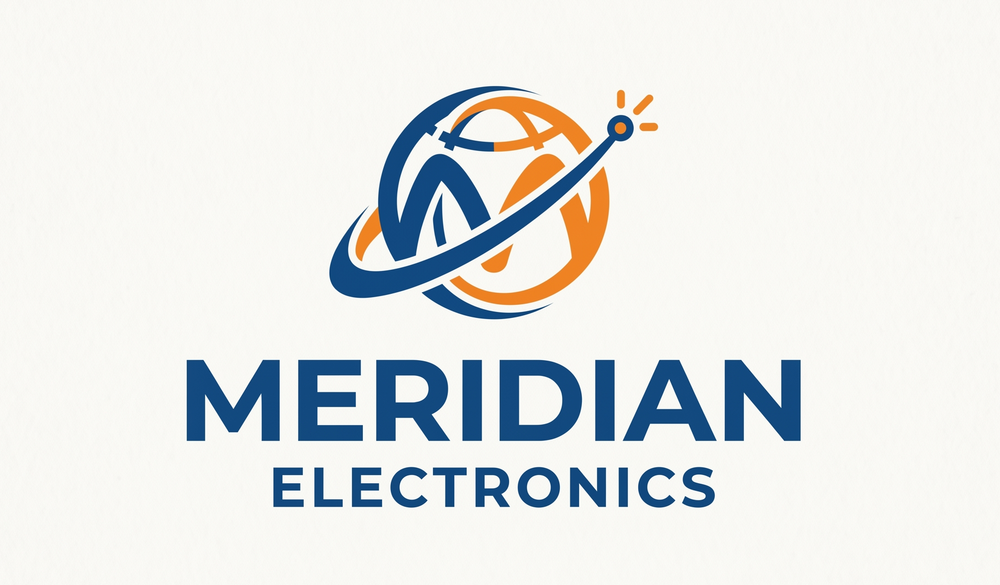

---

## Background

Meridian Electronics is a US-based e-commerce company that sells popular consumer electronics and accessories to a global customer base. Founded in 2018, the company experienced significant growth and expansion, but is now facing challenges brought on by the COVID-19 pandemic.

Meridian Electronics services almost 88,000 customers in 194 countries and possesses over 108,000 transactions, generating sales revenue exceeding $28 million.

Reporting to the Head of Operations, an in-depth analysis was conducted to evaluate Meridian Electronics performance over the four year period (2019–2022). This comprehensive review provides valuable insights that internal cross-functional teams will utilize to streamline processes and enhance Meridian Electronics commercial performance. The key insights and recommendations focus on the following areas:

### North Star Metrics

| Metric | Definition |
|---|---|
| **Sales Revenue** | Revenue from the sale of products in USD |
| **Order Count** | Number of orders placed |
| **Average Order Value (AOV)** | An average of the total USD amount spent per order |
| **Refund Rate** | Percentage of orders returned/refunded per product |

### Key Areas of Analysis

| Area | Description |
|---|---|
| **Sales Trends** | Focusing on key metrics of sales revenue, number of orders placed, and average order value (AOV) |
| **Product Performance** | Analyzing different product lines, market impact, and refund rates to inform strategic product decisions |
| **Loyalty Program Evaluation** | Evaluating the effectiveness of the company's loyalty program and providing recommendations to maximize customer engagement and retention |
| **Regional Results** | Evaluating regional demand and product performance within regions to identify areas for improvement |

---

## Table of Contents

1. [Executive Summary](#executive-summary)
2. [Sales Trends](#sales-trends)
3. [Product Performance](#product-performance)
4. [Loyalty Program](#loyalty-program)
5. [Regional Trends](#regional-trends)
6. [Recommendations](#recommendations)

---

## Data Structure

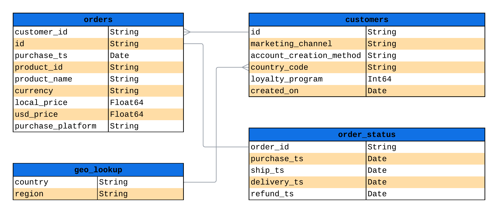

---

## Executive Summary

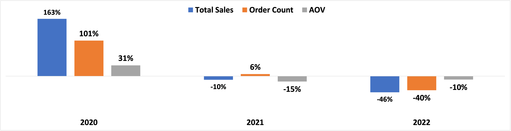

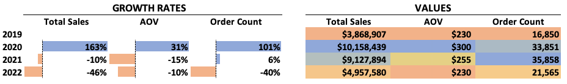

### Sales Trends

- The pandemic caused sales to spike significantly in 2020 and began to normalize by 2022.
- **Seasonality**: Q3 and Q4 see the most sales year to year, lining up with back-to-school and holiday shopping.
- **Action**: Capitalize on the increased traffic/exposure from the pandemic, focusing efforts on Q3/Q4, to drive sales in the following years.

### Product Performance & Returns

- Apple AirPods, ThinkPad Laptop, MacBook Air Laptop, and 27in Gaming Monitor are the main drivers of revenue.
- **Action**: The Bose Headphones and the iPhone significantly underperform. We should discontinue these products to focus on the high-performing items.
- **Action**: Lean into the best performing product category, the 27in 4K Gaming Monitor, by widening our offerings of monitors.
- Laptops — the MacBook Air and the ThinkPad — have the highest return rates (11%, 12%) and are the most expensive products ($1,588 and $1,100).
- **Action**: Investigate the causes of the high rate of laptop returns and develop a strategy to remediate/improve product retention.

### Loyalty Program

- The loyalty program slowly gained traction through 2019–2022 and was responsible for **40%** of the revenue for the period.
- **Action**: Keep the loyalty program, at least until 2023, and continue to bring in new members through exclusive deals and early access to new products to capture returning customers.

### Regional Performance

- NA is the highest performing region, responsible for **~50%** of total revenue per year.
- LATAM is the lowest performing region, but a large opportunity for growth.
- **Action**: Focus marketing on NA while being more strategic in marketing for LATAM.

---

## Deep-Dive Insights

## Sales Trends

### Sales revenue peaked in 2020 followed by a decline starting in 2021

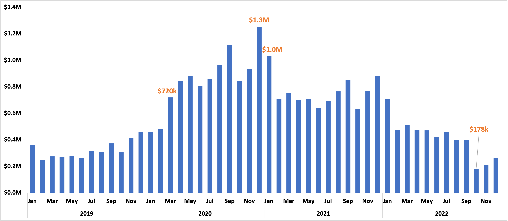

<table>
  <thead>
    <tr>
      <th style="width: 33%;"><strong>Peak Performance in 2020</strong></th>
      <th style="width: 33%;"><strong>Slight Decrease in 2021</strong></th>
      <th style="width: 33%;"><strong>Downward Trend in 2022</strong></th>
    </tr>
  </thead>
  <tbody>
    <tr>
      <td valign="top">
        <ul>
          <li>Revenue grew by <strong>~50% in March of 2020</strong>, marking the beginning of the COVID-19 pandemic.</li>
          <li>Revenue in 2020 totaled over <strong>$10.1M</strong>, with December 2020 <strong>($1.25M)</strong> being the best performing month on record.</li>
          <li>The sharp increase in sales can be explained by increased online shopping and need for remote working technology caused by the pandemic</li>
        </ul>
      </td>
      <td valign="top">
        <ul>
          <li>Sales revenue began to decline in January 2021 <strong>($1.0M)</strong>, starting a downward trend in sales that continued through 2022</li>
        </ul>
      </td>
      <td valign="top">
        <ul>
          <li>2022 experienced a sharp decline in revenue, specifically in the month of October <strong>($178K)</strong>, the lowest performing month on record.</li>
          <li>Total revenue in 2022 <strong>($4.9M)</strong> is still <strong>~28%</strong> higher than the pre-pandemic revenue in 2019 <strong>($3.9M)</strong></li>
          <li>The decline in sales is most likely due to normalization after the pandemic.</li>
        </ul>
      </td>
    </tr>
  </tbody>
</table>

---

### AOV follows a similar trend to sales revenue

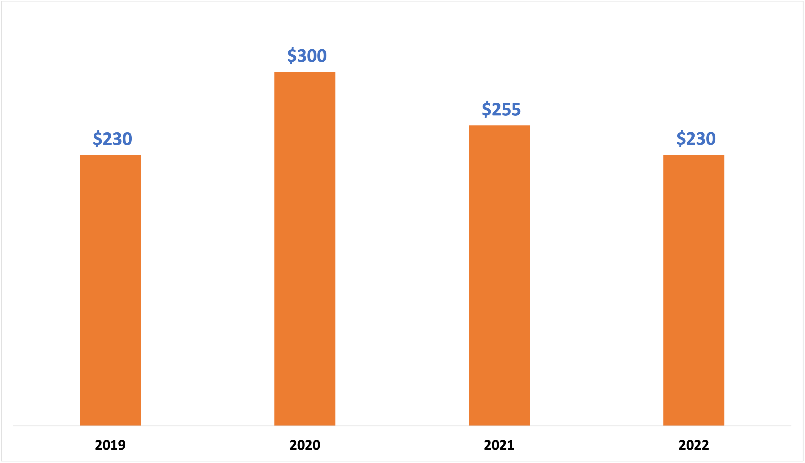

- **Pandemic Surge**: AOV increased by **~31%** from 2019–2020, signaling that customers were placing higher-value orders during the pandemic.
- **Post-Pandemic Decline**: AOV decreased by **15%** in 2021 and by **10%** in 2022, showing that customers ordered lower-value items as the pandemic era concluded.

---

### Order Count hit its highest total in 2021, despite decreasing revenue

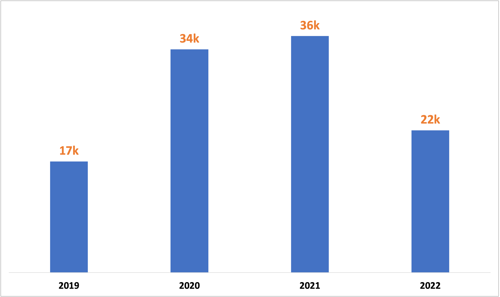

- **Spike in 2020**: The total order count **doubled (101% increase)** from 2019–2020, which helps explain the dramatic increase in sales revenue during that period.
- **Interesting Increase**: Order count actually increased by **5%** from 2020–2021 despite decreased sales revenue, and there was a notable **15%** decrease in AOV during the same period, indicating that customers were placing a greater number of orders on lower-value items.

---

### Seasonality: Q3 and Q4 drive sales revenue, order count, and AOV year to year

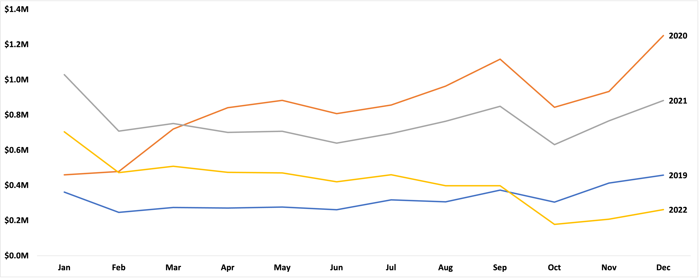

- **Back-to-School Spike**: Sales revenue spikes during Q3, likely caused by the back-to-school season where students and parents are purchasing new devices.
- **Holiday Shopping Spike**: Sales spike in Q4 as well, most likely driven by the holiday shopping season and promotional days during that period (Black Friday, Cyber Monday, etc.).
- **Refined Strategy**: Leverage high-performing periods (Q3 and Q4) to refine marketing and sales strategies.

---

## Product Performance

### The top four products account for 99% of total sales revenue and experience dramatic fluctuations in sales

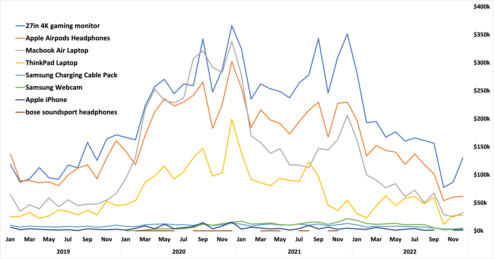

- **Most Volatile Product**: The MacBook Air Laptop experienced the largest swings in sales during the period — increasing by **384%** from 2019 ($600K) to 2020 ($2.9M), dropping by **35%** from 2020 to 2021 ($1.9M), and dropping another **55%** from 2021 to 2022 ($850K) — largely contributing to the dramatic decline in revenue observed following 2020.
- **Decreasing Demand**: The **ThinkPad Laptop** was the only top contributor that did not experience a significant spike in sales in Q4 of 2021; this may indicate the item's popularity among customers is dwindling.
- **Continued Demand**: The **27in 4K Gaming Monitor** consistently leads sales and, while other popular products remained stagnant, saw a spike in sales at the end of Q4 2022, showing that there is consistent demand for the product.
- **Risk and Opportunity**: Sales are concentrated among the top four products, which poses a risk but highlights an opportunity to expand product offerings in specific categories.

---

### 27in 4K Gaming Monitors account for more than one-third (35%) of total sales revenue

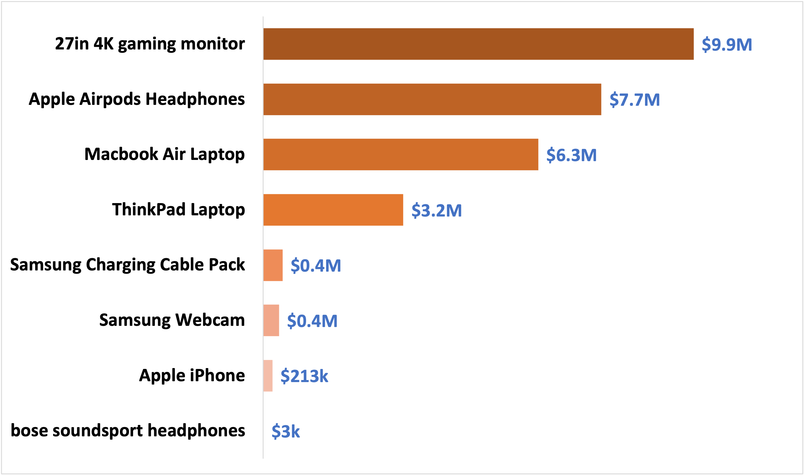

- **Strongest Products**: The 27in 4K Gaming Monitor is the top performing product, followed by the Apple AirPods Headphones; combined they represent **63%** of sales revenue.
- **Weak Performers**: The Apple iPhone and the Bose SoundSport Headphones represent **<1%** of total sales revenue.
- **Widen Offering**: We should lean into the most lucrative product line, the 27in 4K Gaming Monitor, and offer different styles and sizes of monitors.

---

### Apple AirPods Headphones account for nearly half (45%) of the total order volume

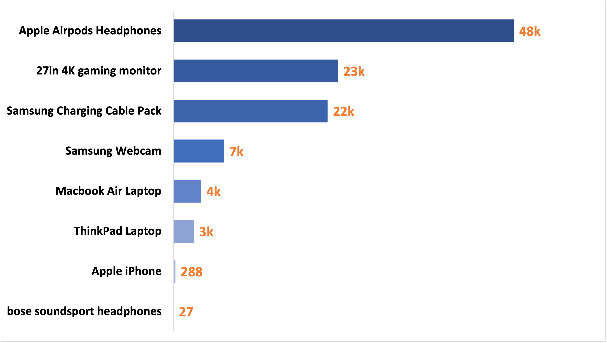

- **Popular Products**: The Apple AirPods Headphones lead orders by a **25K** margin, signaling that their large contribution to total revenue is mainly driven by their popularity.
- **Reliable Contributors**: While the **Samsung Cable Pack** and the **Samsung Webcam** only contribute **2%** to total sales revenue, they are relatively popular items, showing that they are reliable contributors to total revenue and should continue to be offered.
- **Underperformers**: The Apple iPhone and Bose Headphones contribute to **<1%** of total orders. They should be considered for discontinuation, especially the Bose product.

---

### Laptops account for $1.1M in refunds from 2019 to 2021

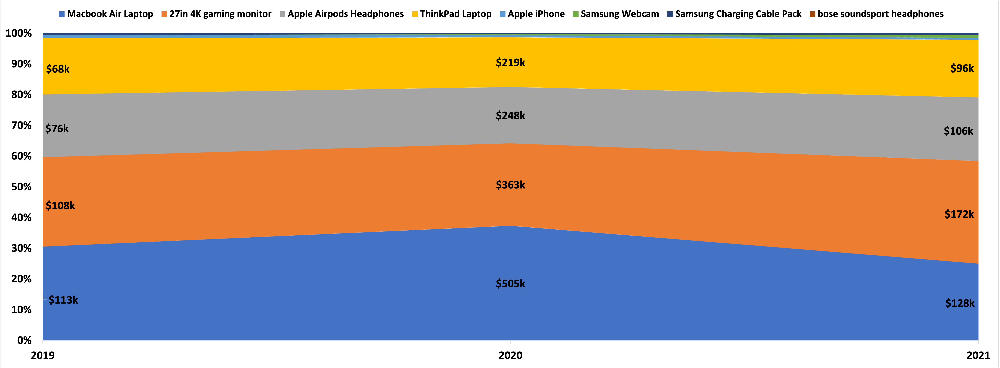

- **High Value Returns**: The MacBook Air Laptops contribute **$746K** and ThinkPad Laptops **$383K** in returns, totaling **$1.1M**. This is cause for concern because laptops only represent **6% of total orders** yet contribute to nearly half of the **$2.2M** in returns.
- **High Return Volume**: The 27in 4K Gaming Monitor **(2.6K)** leads return volume, followed by the Apple AirPods Headphones **(1.4K)**, which makes sense as they are the top-selling items, increasing the likelihood of returns.
- **Data Issue**: The return data for 2022 is missing.

---

### Laptops experience the highest refund rate while being the most expensive products

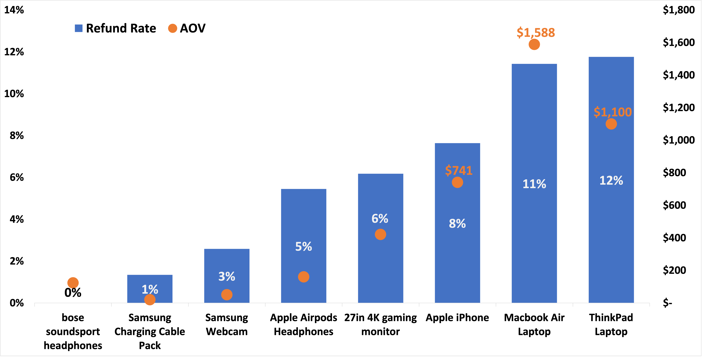

- **Highest Return Rate**: The **MacBook Air** and **ThinkPad** have the highest refund rates and AOV, warranting an investigation to determine the root cause of the returns.
- **Consistent Underperformer**: The **Apple iPhone** also has a high return rate — another reason to consider discontinuing the product.
- **High Volume, Low Rate**: The **Apple AirPods** and the **27in 4K Gaming Monitor** have relatively low rates of return compared to their higher return volume, showing the returns of these products are not a cause for concern.

---

## Loyalty Program

### Loyalty sales revenue began to surpass non-loyalty in 2021

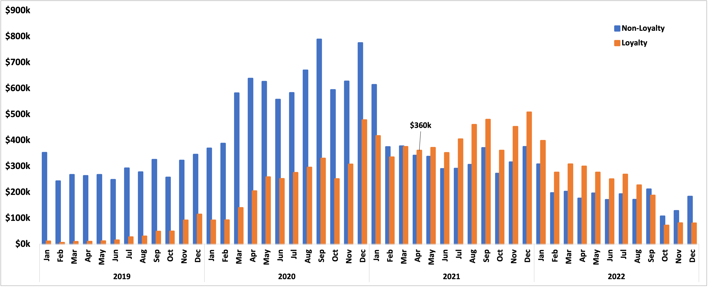

<table>
  <thead align="center">
    <tr>
      <th style="width: 50%;"><strong>Growth Year over Year</strong></th>
      <th style="width: 50%;"><strong>Downward Trend in 2022</strong></th>
    </tr>
  </thead>
  <tbody>
    <tr>
      <td>
        <ul>
            <li>The loyalty program slowly gained traction in Q2 2020 until finally surpasssing the non-loyalty customers in Q4 2022</li> 
            <li>Loyalty members only contributed <strong>~11% ($400k) in 2019</strong> to the yearly revenue, nearly tripled to <strong>~29% ($2.9M) in 2020</strong>, and they contribute nearly <strong>55% ($2.7M) in 2022</strong>.</li>
            <li>Loyalty members contributed <strong>~40% ($11M)</strong> to the total sales revenue for the period of 2019-2022.</li>
            <li>The loyalty program is successful thus far, so it is worth continuing the program and reassessing at the end of 2023.</li>
        </ul>
      </td>
      <td valign="top">
        <ul>
            <li>In Q4 2022, the non-loyalty revenue overtook the loyalty, but based on the trend this seems like a temporary dip and will regain traction in the new year.</li>
            <li><strong>Expand Value</strong>: Explore opportunities to present loyalty members with more value in order to retain their business while the company exits the pandemic era and product demands normalizes</li>
        </ul>
      </td>
    </tr>
  </tbody>
</table>

---

### Apple AirPods Headphones dominated loyalty program orders in 2021

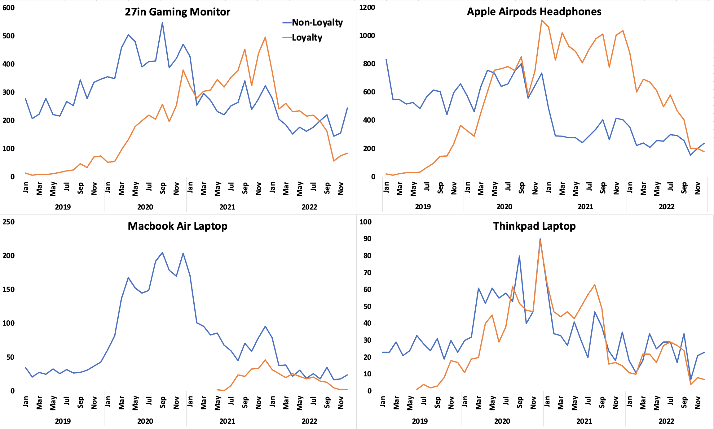

- **Loyalty Order Drivers**: Loyalty program revenue dominance in 2021–2022 was driven by a dramatic increase in orders of Apple AirPods Headphones, the continued growth of orders of the 27in 4K Gaming Monitor and ThinkPad Laptop, and sprouting orders of the MacBook Air Laptop.
- **Shift in AirPods**: Compared to non-loyalty customers, loyalty customers placed about **3x more** orders of Apple AirPods Headphones in 2021, and **2x more** in 2022, accounting for **$2.8M** of sales revenue in 2021–2022 and overshadowing non-loyalty AirPods sales at **$1.1M**.
- **Spike in 2021**: Loyalty program order counts for the 27in Gaming Monitor and the ThinkPad Laptop were about **30% higher** than non-loyalty in 2021, but both had similar order counts in 2022.
- **MacBooks**: In 2019 and 2020, no loyalty customers placed orders for the MacBook Air Laptop. In 2021 and 2022, loyalty customers ordered about **200 units** per year, contributing about **$600K** to sales revenue.
  - **Possible Data Issue**: Based on the other data, it seems unlikely that no loyalty members purchased MacBooks prior to 2021, so this data may be missing.
- **Maintain Program Growth**: Capitalize on the popularity of the Apple AirPods and offer promotional deals to members, as well as cultivate the growing appeal of the MacBook Air among loyalty members with a bundle deal.

---

### Loyalty AOV outpaced non-loyalty starting in 2021

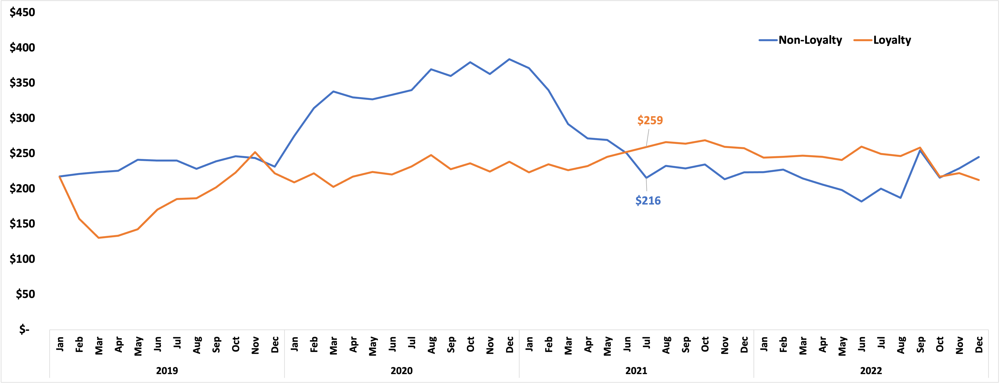

- **AOV Growth**: Similar to the trend in sales revenue, loyalty members' AOV slowly grew by **20%** from 2019 to 2021, and in 2022 they spent an average of **15% more per order** than non-loyalty members.
- **AOV Drivers**: In July of 2021, loyalty AOV overtook non-loyalty AOV, driven by an increase in laptop purchases by loyalty members and a simultaneous decrease in laptop purchases by non-loyalty members from June to July of 2021.
  - This may indicate that customers are more likely to join the loyalty program before placing orders for higher-value products.

---

## Regional Trends

### North America consistently leads sales

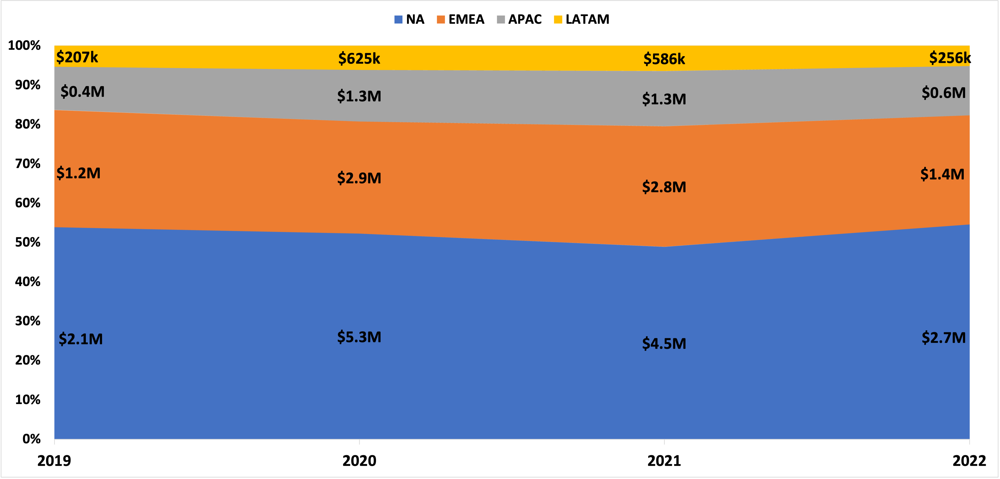

- **Top Performing Regions**: NA leads all regions in sales, contributing **$14.6M**, followed by EMEA at **$8.2M**, showing that most sales originate in western countries. Marketing efforts should focus on these regions to maintain their sales presence.
- **Weakest Region, Large Opportunity**: LATAM performed the worst out of all regions, contributing **$1.7M** in total revenue; however, LATAM responded similarly to the other regions during revenue spikes meaning demand exists. Increased marketing in the region and strategically scheduled sales around region-specific holidays can lead to sales growth.

---

### Apple AirPods Headphones drive order volume in all regions

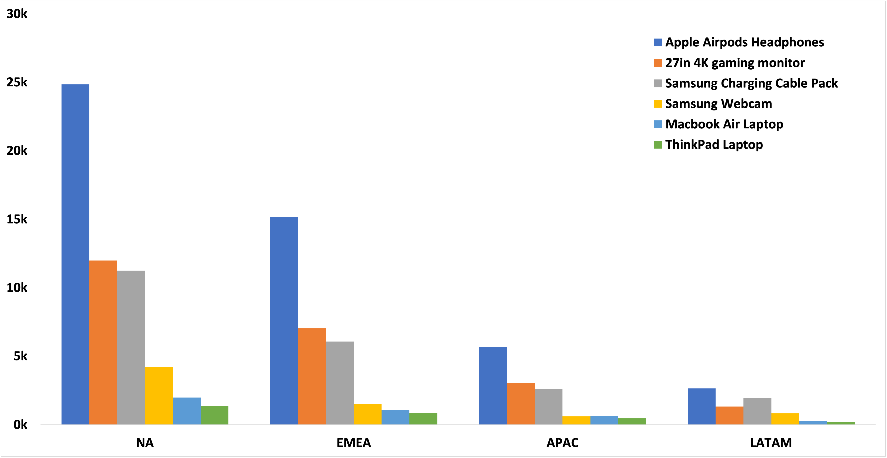

- **AirPods Dominate Orders**: AirPods consistently sell the best in every region accounting for an average of **43%** of total orders in each region, followed by the 27in 4K Gaming Monitor at an average of **23%**.
- **Sales Leader**: The 27in 4K Gaming Monitor is the largest contributor to sales in every region accounting for an average of **35%** of total sales revenue.
- **Similar Demand**: Since all the regions show similar demand for each product, we can expect that each region will respond similarly to new product offerings and promotions.

---

## Recommendations

| Priority | Action | Owner | Expected Impact | Metric to Track |
|---|---|---|---|---|
| 🔴 P0 | **Double down on Q3/Q4** — Concentrate marketing and promotions around Back-to-School and the holiday shopping period. December 2020 peaked at **$1.25M**. | Marketing | Recover momentum lost in 2022 ($4.9M) toward the 2020 peak of $10.1M. | Monthly revenue; Q3/Q4 revenue share |
| 🔴 P0 | **Investigate laptop returns** — MacBook Air (**11%** refund rate) and ThinkPad (**12%**) generated **$1.1M** in refunds — nearly half of all returns despite being only **6%** of orders. | Product / Ops | Reducing rates to category average could recover significant margin on the two highest-AOV products ($1,588 and $1,100). | Refund rate by product; refund $ value |
| 🔴 P0 | **Expand monitor offerings** — The 27in 4K Gaming Monitor drives **35%** of revenue and was the only top product to grow in Q4 2022. | Merchandising | New sizes and price tiers reduce over-reliance on MacBook Air, which swung from $2.9M to $850K between 2020–2022. | Monitor revenue share; new product order count |
| 🟡 P1 | **Discontinue iPhone and Bose Headphones** — Both account for less than **1%** of revenue and orders. iPhone also carries a high return rate. | Merchandising | Reduces catalog overhead and frees resources for top-performing products. | Revenue concentration in top products |
| 🟡 P1 | **Grow the loyalty program** — Members grew from **11%** of revenue in 2019 to **55%** in 2022. Loyalty customers spend **15%** more per order. Offer exclusive deals and bundle promotions (e.g., MacBook + AirPods). | Marketing / CX | Sustains the upward trajectory and reverses the Q4 2022 dip where non-loyalty briefly overtook loyalty revenue. | Loyalty revenue share; loyalty AOV; repeat rate |
| 🟡 P1 | **Invest in LATAM marketing** — LATAM contributed only **$1.7M** vs. NA's **$14.6M**. Time campaigns around regional holidays. | Marketing | Closing part of the gap with EMEA ($8.2M) would meaningfully lift total revenue post-pandemic. | LATAM revenue; order count YoY |
| 🟢 P2 | **Resolve missing data** — 2022 return data is absent; loyalty MacBook orders show zero pre-2021, likely a pipeline issue. | Data Eng | Enables accurate refund tracking and loyalty analysis for future reporting cycles. | Data completeness; 2022 refund availability |
